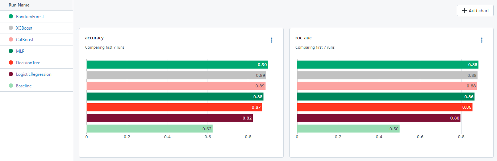
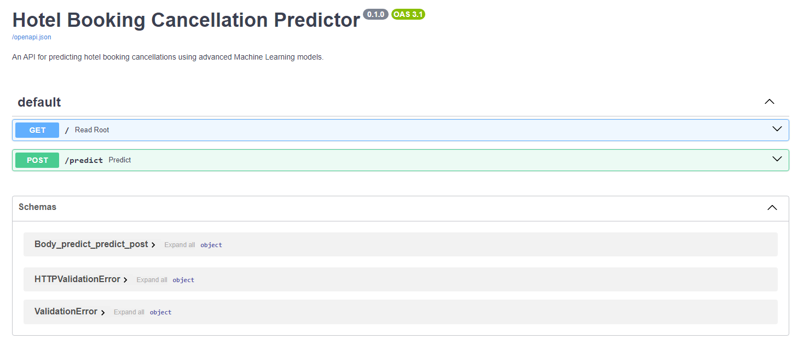

# Predictive Analytics for Hotel Booking Cancellations

## Table of Contents

  * [1. Project Overview](#1-project-overview)
  * [2. Key Features](#2-key-features)
  * [3. Dataset](#3-dataset)
  * [4. Model Performance Results](#4-model-performance-results)
  * [5. Project Structure](#5-project-structure)
  * [6. Getting Started](#6-getting-started)
  * [7. Clean Up](#7-clean-up)
  * [8. Docker Configuration](#8-docker-configuration)

## 1. Project Overview

Welcome to the Predictive Analytics for Hotel Booking Cancellations project! This repository showcases a comprehensive exploration of hotel booking data, coupled with the development of robust Machine Learning models to predict and analyze booking cancellations.

## 2. Key Features:

- **Versatile Predictive Models:** Utilized a diverse set of machine learning models, such as Logistic Regression, Decision Tree, Random Forest, XGBoost, CatBoost, and Multi-layer Perceptron, to conduct comprehensive and sophisticated predictive analysis.

- **Seamless MLflow Integration:** Integrated MLflow to facilitate experiment tracking and efficient model management. Explore detailed model artifacts, experiment search functionalities, and tracking insights conveniently located within the experiments/mlflow directory.

- **Real-time FastAPI Application:** Implemented a FastAPI application for instantaneous interaction with the trained models. Delve into the provided endpoint to witness real-time predictions firsthand, enhancing accessibility and usability.

## 3. Dataset

The dataset utilized in this project is derived from [Hotel booking demand](https://www.kaggle.com/datasets/jessemostipak/hotel-booking-demand), originally from the article [Hotel Booking Demand Datasets](https://www.sciencedirect.com/science/article/pii/S2352340918315191).

## 4. Model Performance Results

Explore the performance metrics and insights gained from training various machine learning models. The image below illustrates a snapshot from MLflow, showcasing key results and metrics:



## 5. Project Structure

    ├── app.py                          # Main script for FastAPI application
    ├── app_input_example/
    │   └── app_input_example.csv       # Example input data for FastAPI application
    ├── data/                        
    │   ├── processed/                  # Processed data directory
    │   │   └── data.csv                # Processed data for modeling
    │   └── raw/                        # Raw data directory
    │       └── hotel-booking-demand/   # Original hotel booking demand dataset
    ├── Dockerfile                      # Docker configuration file
    ├── experiments/                 
    │   └── mlflow/                     # MLflow experiment artifacts and tracking
    │       ├── mlartifacts/         
    │       └── mlruns/               
    ├── images/                         # Directory for storing project images
    ├── logs/                           # Directory for log files
    │   └── hotel_model.log             # Log file for the hotel model
    ├── Makefile                        # Makefile for project automation
    ├── models/                      
    │   ├── hotel_model/                # Directory for the trained ML model
    │   │   └── model.pkl               # Serialized model file
    │   ├── one_hot_encoder.pkl         # Pickle file for one-hot encoder
    │   ├── ordinal_encoder.pkl         # Pickle file for ordinal encoder
    │   ├── standard_scaler.pkl         # Pickle file for standard scaler
    │   └── target_encoder.pkl          # Pickle file for target encoder
    ├── notebooks/                   
    │   └── Exploratory Data Analysis (EDA).ipynb # Jupyter notebook for data exploration
    ├── README.md                       # Project documentation
    ├── requirements.txt                # Project dependencies
    └── src/                         
        ├── config/                     # Configuration files directory
        │   └── config.yaml             # Configuration file
        ├── data/                    
        │   ├── load.py                 # Script to load raw data
        │   ├── preprocess.py           # Script for data preprocessing
        │   └── transform.py            # Script for data transformation
        ├── experiments/             
        │   ├── mlflow_experiments.py   # Script for MLflow experiments
        │   └── mlflow_search.py        # Script for MLflow experiment search (find best model)
        ├── models/                  
        │   ├── baseline_model.py       # Script for baseline model
        │   ├── predict_model.py        # Script for model prediction
        │   └── train_model.py          # Script for model training
        ├── utils/                   
        │   ├── dirs.py                 # Utility for directory creation
        │   └── logger.py               # Utility for logging
        └── visualization/           
            └── visualize.py            # Script for data visualization


## 6. Getting Started

1. **Clone the Project Repository**

   ```bash
   git clone https://github.com/riaa3102/predictive-analytics-hotel-booking.git
   ```

2. **Install Project Dependencies:**

   ```bash
   make install
   ```
   
3. **Download the Dataset:**

   ```bash
   make load
   ```

4. **Explore Data with Exploratory Data Analysis (EDA):**

   ```bash
   make eda
   ```
   
5. **Preprocess the Data:**

   ```bash
   make preprocess
   ```
   
6. **Launch MLflow UI and Tracking Server:**

   ```bash
   make mlflow
   ```
   
Visit [localhost:8000](http://localhost:8000/) in your browser to interact with the MLflow UI.
   
7. **Run the Baseline Model:**

   ```bash
   make baseline
   ```
   
8. **Train Machine Learning Models:**

   ```bash
   make train model=<model-name>
   ```

> **_NOTE:_** <model-name> options include 'lr', 'dt', 'rf', 'xgboost', 'catboost', 'mlp'.

9. **Run FastAPI Interactive API Documentation:**

   ```bash
   make app
   ```

Visit [localhost:5000/docs](http://localhost:5000/docs) in your browser to interact with the FastAPI app.



Above is a screenshot of the FastAPI app running locally.

## 7. Clean Up

- Clean Up Generated Files and Directories

   ```bash
   make clean
   ```

## 8. Docker Configuration

- Build the Docker image and run the container with the following commands:

  8.1. **Build the Docker Image:**

     ```bash
     docker build . -t hotel_app
     ```

  8.2. **Run the Docker Container:**

     ```bash
     docker run -p 5000:5000 --name hotel_app hotel_app
     ```

For further details and available targets, refer to the instructions in the Makefile. Utilize the `make help` command to view target descriptions.

Feel free to explore the notebooks, scripts, and folder structure to gain a deeper understanding of the project. If you have any questions or need additional information, don't hesitate to reach out!
